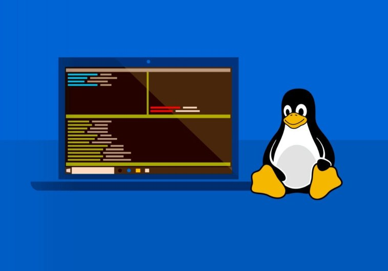

<p align="center">
  
</p>

<h1 align="center">Welcome to my WSL setup repository</h1>

>
> My personal environment setup in WSL2 (Ubuntu 20.4)
>

## ➤ Menu

<p align="left">
  <a href="#-description">Description</a>&nbsp;&nbsp;&nbsp;|&nbsp;&nbsp;&nbsp;
  <a href="#-features">Features</a>&nbsp;&nbsp;&nbsp;|&nbsp;&nbsp;&nbsp;
  <a href="#-how-to-contribute">How to contribute</a>
</p>

## ➤ Getting Started

If you want use this repository you need to make a **git clone**:


>
> 1. git clone --depth 1 https://github.com/lpmatos/wsl-dev-setup.git -b master
>


This will give access on your **local machine**.

## ➤ Tools

* Ubuntu
* ZSH
* Git
* Node, Yarn, NVM
* Ruby, Renv
* GoLang
* OH MY ZSH + Zinit + Plugins + Themes

## ➤ Description

Template description.

## ➤ Install

#### Kubectl

```bash
sudo apt-get update && sudo apt-get install -y apt-transport-https gnupg2 curl
curl -s https://packages.cloud.google.com/apt/doc/apt-key.gpg | sudo apt-key add -
echo "deb https://apt.kubernetes.io/ kubernetes-xenial main" | sudo tee -a /etc/apt/sources.list.d/kubernetes.list
sudo apt-get update
sudo apt-get install -y kubectl
```

#### Helm

```bash
curl https://raw.githubusercontent.com/helm/helm/master/scripts/get-helm-3 | bash
```

#### K3D

```bash
curl -s https://raw.githubusercontent.com/rancher/k3d/main/install.sh | bash
```

#### GitHub CLI

```bash
sudo apt-key adv --keyserver keyserver.ubuntu.com --recv-key C99B11DEB97541F0
sudo apt-add-repository https://cli.github.com/packages
sudo apt update
sudo apt install gh
```

#### Golang

```bash
wget -q -O - https://raw.githubusercontent.com/canha/golang-tools-install-script/master/goinstall.sh | bash
```

#### Gitleaks

```
VER="7.2.0"
wget https://github.com/zricethezav/gitleaks/releases/download/v$VER/gitleaks-linux-amd64
mv gitleaks-linux-amd64 gitleaks
chmod +x gitleaks
sudo mv gitleaks /usr/local/bin/
```

#### Lab

```bash
curl -s https://raw.githubusercontent.com/zaquestion/lab/master/install.sh | sudo bash
```

#### NVM

```bash
VER="0.37.2"
curl -o- https://raw.githubusercontent.com/nvm-sh/nvm/v$VER/install.sh | bash
```

#### Node

```
NODE_VERSION="14.15.4"
nvm install $NODE_VERSION --lts=Fermium --latest-npm && nvm use $NODE_VERSION
```

## ➤ Features

* Default gitignore and editorconfig.
* GitLeaks file.
* Semantic Release file.
* NPM modules automation.
  * Commitlint - Conventional Commits.
  * Git Hooks with Husky.

## ➤ How to contribute

>
> 1. Make a **Fork**.
> 2. Follow the project organization.
> 3. Add the file to the appropriate level folder - If the folder does not exist, create according to the standard.
> 4. Make the **Commit**.
> 5. Open a **Pull Request**.
> 6. Wait for your pull request to be accepted.. 🚀
>

Remember: There is no bad code, there are different views/versions of solving the same problem. 😊

## ➤ Add to git and push

You must send the project to your GitHub after the modifications

>
> 1. git add -f .
> 2. git commit -m "Added - Fixing somethings"
> 3. git push origin master
>

## ➤ Versioning

- We currently do not have a CHANGELOG.md generated.

## ➤ Author

👤 **Lucca Pessoa**

Hey!! If you like this project or if you find some bugs feel free to contact me in my channels:

>
> * Email: luccapsm@gmail.com
> * Website: https://github.com/lpmatos
> * Github: [@lpmatos](https://github.com/lpmatos)
> * GitLab: [@lpmatos](https://gitlab.com/lpmatos)
> * LinkedIn: [@luccapessoa](https://www.linkedin.com/in/luccapessoa/)
>

## ➤ Show your support

Give a ⭐️ if this project helped you!

---

_This README was generated with ❤️ by me_
